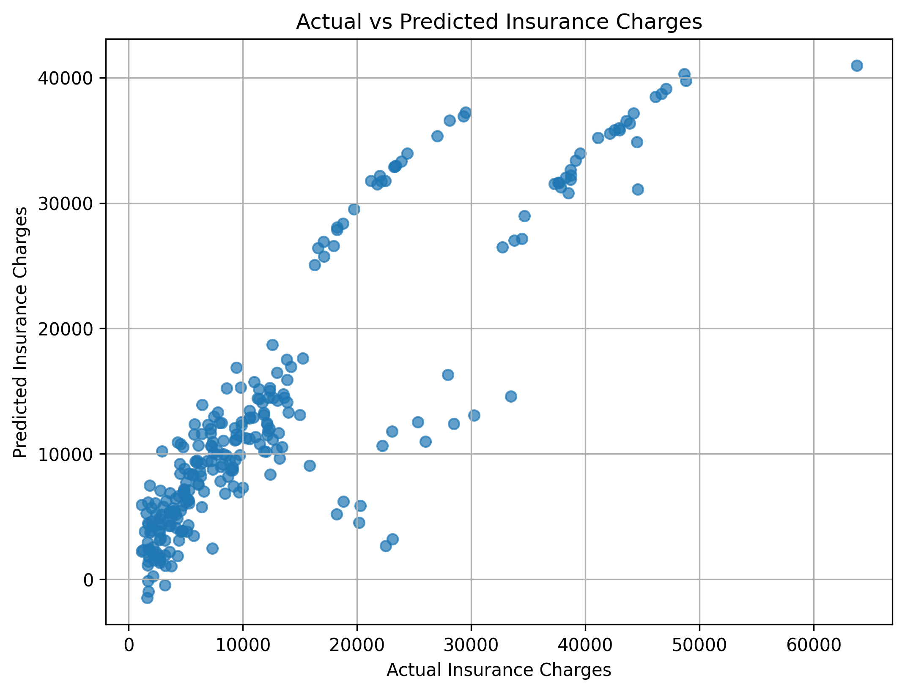

# Medical Insurance Cost Prediction using Multiple Linear Regression

## 📌 Objective

The objective of this project is to develop a Multiple Linear Regression model that predicts medical insurance charges based on customer attributes such as age, sex, BMI, number of children, smoking status, and region.

---

## 📂 Dataset

**Medical Cost Personal Insurance Dataset**

Kaggle Dataset:
https://www.kaggle.com/datasets/mirichoi0218/insurance

> Note: The dataset has not been uploaded to this repository in accordance with the assignment instructions. Please download it from the Kaggle link above.

---

## 🛠️ Libraries Used

- pandas
- numpy
- matplotlib
- seaborn
- scikit-learn
- jupyter

---

## ⚙️ Methodology

1. Loaded the dataset using Pandas.
2. Performed data understanding and exploratory analysis.
3. Checked for missing values.
4. Encoded categorical variables using Label Encoding.
5. Split the dataset into 80% training and 20% testing.
6. Built a Multiple Linear Regression model.
7. Predicted insurance charges.
8. Evaluated the model using MAE, MSE, and R² Score.
9. Visualized Actual vs Predicted values using a scatter plot.

---

## 📊 Results

The Multiple Linear Regression model was successfully trained and evaluated. The model achieved a satisfactory R² Score and generated reasonably accurate predictions for insurance charges. The Actual vs Predicted scatter plot demonstrates that the model captures the overall trend of the data.

---

## 📈 Model Evaluation Metrics

The model was evaluated using:

- Mean Absolute Error (MAE)
- Mean Squared Error (MSE)
- R² Score

---

## 📷 Output

The project includes:

- Jupyter Notebook (`Assignment-1.ipynb`)
- Actual vs Predicted Scatter Plot
- Model Evaluation Metrics

## 📷 Actual vs Predicted Scatter Plot

---

## ✅ Conclusion

The Multiple Linear Regression model effectively predicts medical insurance charges based on customer information such as age, BMI, smoking status, region, and number of children. Although the model performs well, Linear Regression assumes a linear relationship among variables, which may not fully represent real-world insurance pricing. More advanced regression algorithms could further improve prediction accuracy.

---

## 👩‍💻 Author

**Khushie Brahma**

AI/ML Internship Assignment 1
