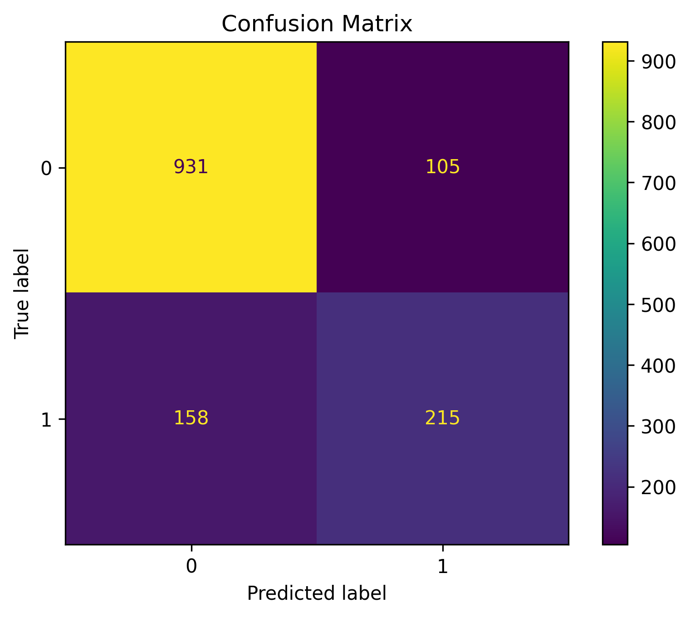

# Customer Churn Prediction using Logistic Regression

## 📌 Objective

The objective of this project is to develop a Logistic Regression model that predicts whether a customer is likely to churn based on demographic information and service usage.

---

## 📂 Dataset

**Telco Customer Churn Dataset**

Kaggle Dataset:

https://www.kaggle.com/datasets/blastchar/telco-customer-churn

> Note: The dataset has not been uploaded to this repository in accordance with the assignment instructions. Please download it from the Kaggle link above.

---

## 🛠️ Libraries Used

- pandas
- numpy
- matplotlib
- seaborn
- scikit-learn
- jupyter

---

## ⚙️ Methodology

1. Loaded the dataset using Pandas.
2. Performed data understanding.
3. Checked and handled missing values.
4. Converted `TotalCharges` to numeric format.
5. Encoded categorical variables using Label Encoding.
6. Split the dataset into training and testing sets (80:20).
7. Built a Logistic Regression model.
8. Predicted customer churn.
9. Evaluated the model using Accuracy, Precision, Recall, F1-Score, and Confusion Matrix.

---

## 📊 Results

The Logistic Regression model successfully classified customer churn with good performance. The evaluation metrics indicate that the model effectively distinguishes between customers who are likely to churn and those who are not.

---

## 📈 Model Evaluation

The model was evaluated using:

- Accuracy Score
- Precision
- Recall
- F1-Score
- Confusion Matrix

---

## 📷 Output

The repository includes:

- Jupyter Notebook (`Assignment-2.ipynb`)
- Confusion Matrix
- Model Evaluation Metrics

### Confusion Matrix

---

## ✅ Conclusion

The Logistic Regression model effectively predicts customer churn using customer demographic and service-related information. Important factors such as contract type, monthly charges, tenure, and internet services influence customer churn. Although the model performs well, Logistic Regression assumes a linear relationship between the input features and the target variable, which may limit its performance on more complex datasets.

---

## 👩‍💻 Author

**Khushie Brahma**