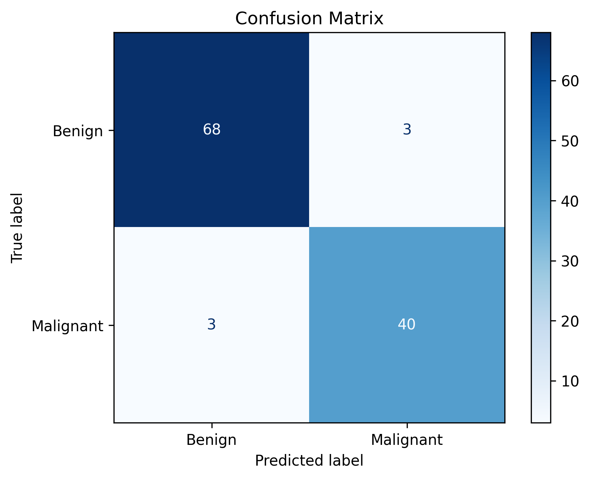

# Assignment 4 – Breast Cancer Classification using K-Nearest Neighbors (KNN)

## Objective

The objective of this assignment is to develop a K-Nearest Neighbors (KNN) classification model to predict whether a breast tumor is malignant or benign using diagnostic measurements.

---

## Dataset

**Breast Cancer Wisconsin Diagnostic Dataset**

Kaggle Link:

https://www.kaggle.com/datasets/uciml/breast-cancer-wisconsin-data

> **Note:** The dataset is not included in this repository. Please download it from the Kaggle link above.

---

## Libraries Used

- pandas
- numpy
- matplotlib
- seaborn
- scikit-learn

---

## Methodology

1. Loaded and explored the dataset.
2. Checked for missing values.
3. Removed unnecessary columns.
4. Encoded the target variable.
5. Standardized the feature values.
6. Split the dataset into 80% training and 20% testing sets.
7. Trained a KNN classifier with **K = 5**.
8. Predicted the class labels for the testing dataset.
9. Evaluated the model using Accuracy, Precision, Recall, F1-Score, and Confusion Matrix.

---

## Results

The KNN classifier successfully classified breast tumors with high accuracy. The evaluation metrics indicated strong classification performance, and the confusion matrix showed that most samples were correctly classified.

### Confusion Matrix



---

## Conclusion

K-Nearest Neighbors (KNN) effectively classified breast tumors by utilizing feature similarity. Feature scaling significantly improved the model's performance, making KNN well-suited for this dataset.

---

## Repository Structure

```text
Assignment-04/
│
├── notebook/
│   └── Assignment-4.ipynb
│
├── images/
│   └── confusion_matrix.png
│
├── report/
│
├── data/
│
├── README.md
│
└── requirements.txt
```