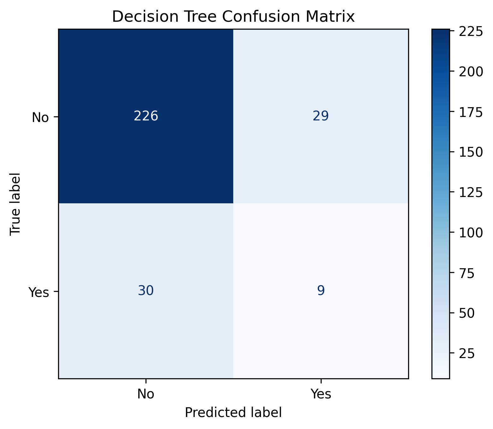
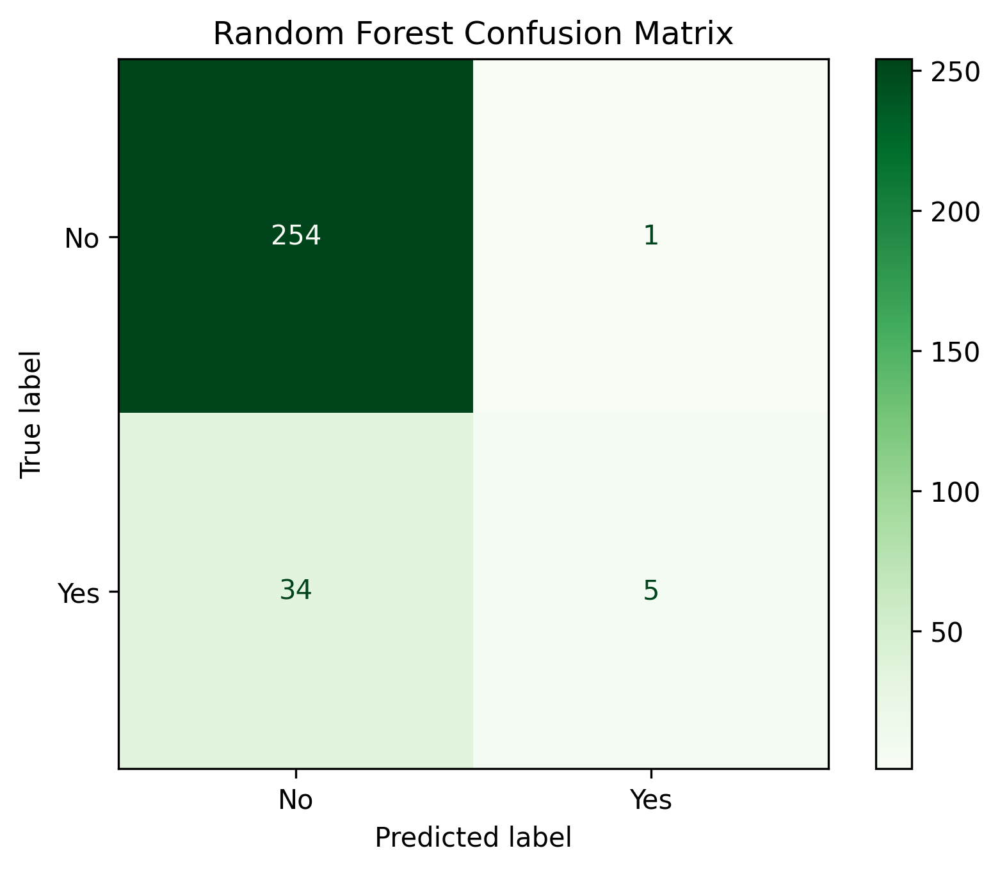
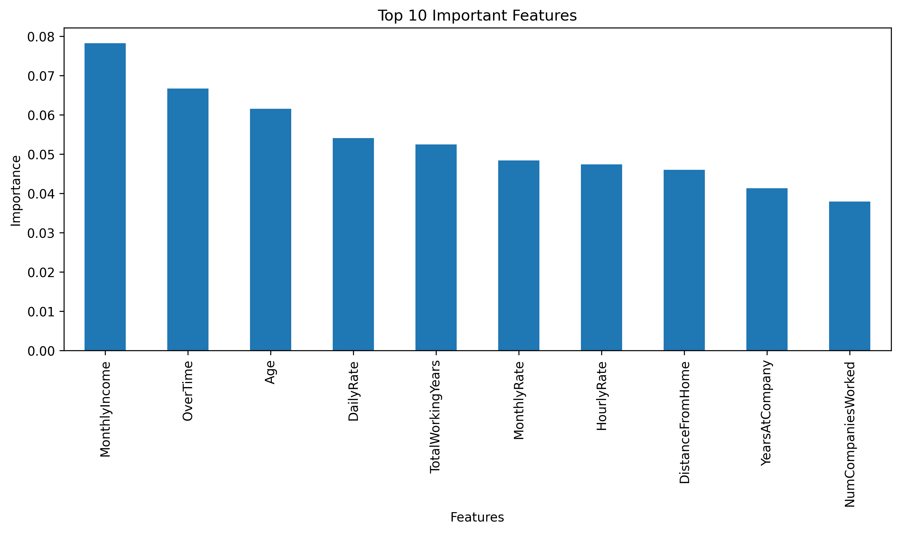

# 📊 Employee Attrition Prediction using Decision Tree and Random Forest

## 📌 Objective

The objective of this project is to predict employee attrition using machine learning classification algorithms. Decision Tree and Random Forest classifiers are developed, evaluated, and compared to determine which model performs better in predicting whether an employee is likely to leave the organization.

---

## 📂 Dataset

**IBM HR Analytics Employee Attrition & Performance Dataset**

Kaggle Dataset:
https://www.kaggle.com/datasets/pavansubhasht/ibm-hr-analytics-attrition-dataset

> **Note:** The dataset is not included in this repository. Please download it from the Kaggle link above.

---

## 🛠️ Libraries Used

- Pandas
- NumPy
- Matplotlib
- Seaborn
- Scikit-learn

---

## ⚙️ Methodology

1. Imported the required libraries.
2. Loaded the IBM HR Analytics dataset.
3. Performed exploratory data analysis.
4. Checked for missing values.
5. Removed unnecessary columns.
6. Encoded categorical variables using Label Encoding.
7. Split the dataset into 80% training and 20% testing sets.
8. Trained a Decision Tree Classifier.
9. Trained a Random Forest Classifier with 100 estimators.
10. Evaluated both models using Accuracy, Precision, Recall, and F1-Score.
11. Generated confusion matrices.
12. Visualized the top 10 important features using the Random Forest model.

---

## 📈 Results

The performance of both models was evaluated using:

- Accuracy
- Precision
- Recall
- F1-Score

Confusion matrices were generated for both models, and the Random Forest model's feature importance was visualized to identify the most influential features affecting employee attrition.

---

## 📊 Model Comparison

| Metric | Decision Tree | Random Forest |
|----------|--------------:|--------------:|
| Accuracy | 0.7993 | 0.8810 |
| Precision | 0.2368 | 0.8333 |
| Recall | 0.2308 | 0.1282 |
| F1-Score | 0.2338 | 0.2222 |

The Random Forest classifier achieved better overall performance due to its ensemble learning approach, which reduces overfitting and improves prediction accuracy.

---

## 🖼️ Project Images

### Decision Tree Confusion Matrix



---

### Random Forest Confusion Matrix



---

### Feature Importance



---

## ✅ Conclusion

Both Decision Tree and Random Forest models were successfully developed for employee attrition prediction. The Random Forest classifier outperformed the Decision Tree classifier by providing better overall classification performance. Its ensemble learning technique reduces overfitting and improves generalization, making it a more reliable model for predicting employee attrition.

---

## 📁 Repository Structure

```
Assignment-05/
│
├── data/
├── images/
│   ├── decision_tree_confusion_matrix.png
│   ├── random_forest_confusion_matrix.png
│   └── feature_importance.png
│
├── notebook/
│   └── Assignment-5.ipynb
│
├── README.md
└── requirements.txt
```

---

## 👩‍💻 Author

**Khushie Brahma**
