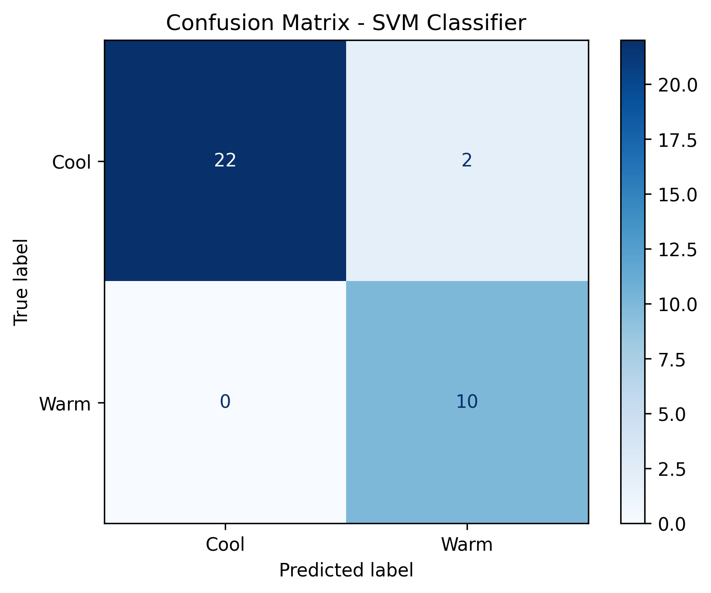

# Assignment 6

# Weather Condition Classification using Support Vector Machine (SVM) and Open-Meteo API

## Objective

The objective of this assignment is to collect weather data from the Open-Meteo API, preprocess the data, and develop a Support Vector Machine (SVM) classifier to classify weather conditions as **Cool** or **Warm** based on meteorological observations.

---

## API Documentation

Open-Meteo API

https://open-meteo.com/

---

## Libraries Used

- pandas
- numpy
- requests
- matplotlib
- seaborn
- scikit-learn
- jupyter

---

## Methodology

1. Collected weather data from the Open-Meteo API.
2. Converted the JSON response into a Pandas DataFrame.
3. Created the target variable **Weather_Class** using the temperature threshold.
4. Checked for missing values and removed unnecessary columns.
5. Encoded the target variable.
6. Split the dataset into 80% training and 20% testing sets.
7. Standardized the feature values using StandardScaler.
8. Built an SVM classifier with the RBF kernel.
9. Evaluated the model using Accuracy, Precision, Recall, F1-Score, and Confusion Matrix.

---

## Results

| Metric | Value |
|---------|-------:|
| Accuracy | 0.9412 |
| Precision | 0.8333 |
| Recall | 1.0000 |
| F1-Score | 0.9091 |

---

## Confusion Matrix



---

## Conclusion

The Support Vector Machine (SVM) classifier successfully classified weather conditions using meteorological features obtained from the Open-Meteo API. After preprocessing and feature scaling, the model achieved an accuracy of **94.12%**, demonstrating strong classification performance. Feature scaling improved the effectiveness of the SVM algorithm by ensuring all input features contributed equally during training. SVM is highly effective for classification problems with well-separated classes; however, it can be computationally expensive for large datasets and requires careful parameter tuning.

---

## Repository Structure

```text
Assignment-06/
│
├── notebook/
│   └── Assignment-6.ipynb
│
├── images/
│   └── confusion_matrix.png
│
├── README.md
└── requirements.txt
```