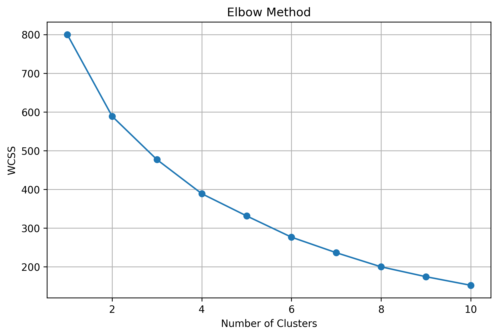
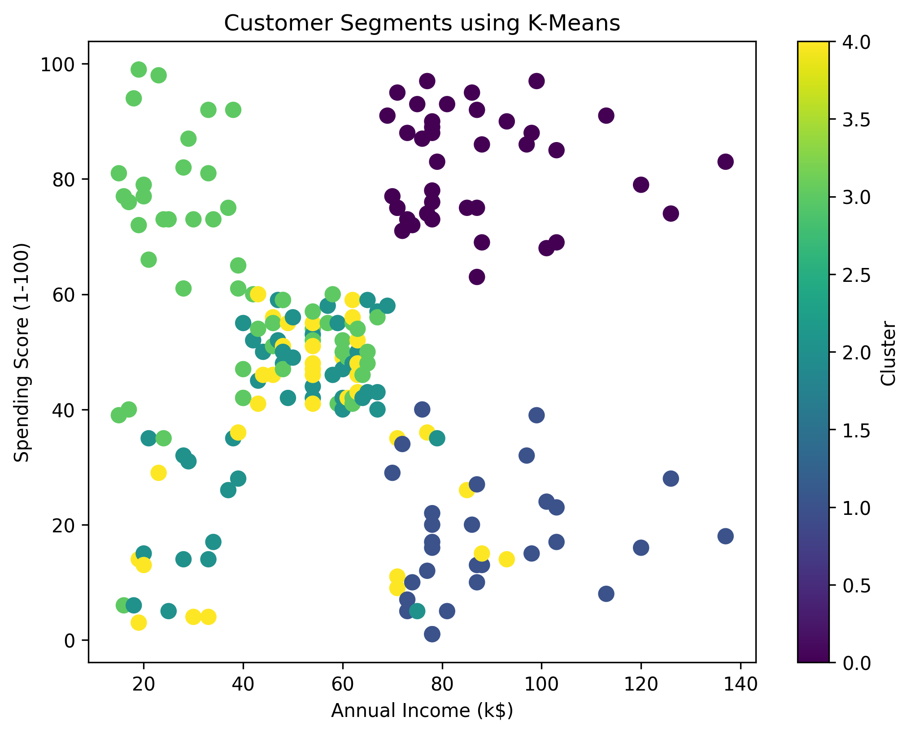
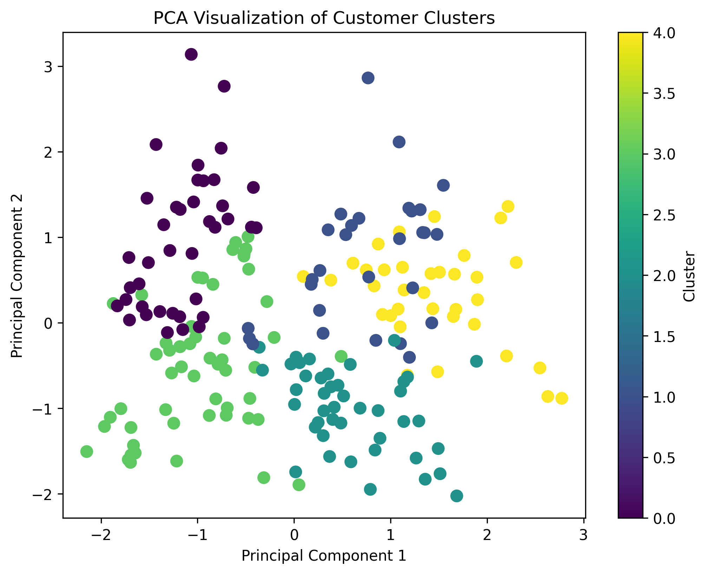

# Assignment 7

# Customer Segmentation using K-Means Clustering and Principal Component Analysis (PCA)

## Objective

The objective of this assignment is to perform customer segmentation using the K-Means Clustering algorithm and visualize customer groups using Principal Component Analysis (PCA).

---

## Dataset Link

Mall Customer Segmentation Dataset

https://www.kaggle.com/datasets/vjchoudhary7/customer-segmentation-tutorial-in-python

---

## Libraries Used

- pandas
- numpy
- matplotlib
- seaborn
- scikit-learn
- jupyter

---

## Methodology

1. Loaded the Mall Customer Segmentation dataset.
2. Performed data preprocessing.
3. Removed the CustomerID column.
4. Encoded the Gender column.
5. Standardized the numerical features.
6. Used the Elbow Method to determine the optimal number of clusters.
7. Trained the K-Means clustering model.
8. Applied PCA to reduce the dataset to two principal components.
9. Visualized the customer clusters.

---

## Results

- Optimal Number of Clusters: **5**
- Customer segmentation completed successfully.
- PCA reduced the dataset to two principal components for visualization.

---

## Visualizations

### Elbow Curve



### Customer Clusters



### PCA Visualization



---

## Conclusion

The K-Means clustering model successfully segmented customers into five meaningful groups based on their annual income and spending behavior. PCA effectively reduced the dataset to two dimensions, making cluster visualization easier. Customer segmentation is valuable for targeted marketing and personalized business strategies. While K-Means is simple and efficient, it requires selecting the number of clusters beforehand. PCA improves visualization by reducing dimensionality while preserving most of the important information.

---

## Repository Structure

```text
Assignment-07/
│
├── notebook/
│   └── Assignment-7.ipynb
│
├── images/
│   ├── elbow_curve.png
│   ├── customer_clusters.png
│   └── pca_clusters.png
│
├── README.md
└── requirements.txt
```