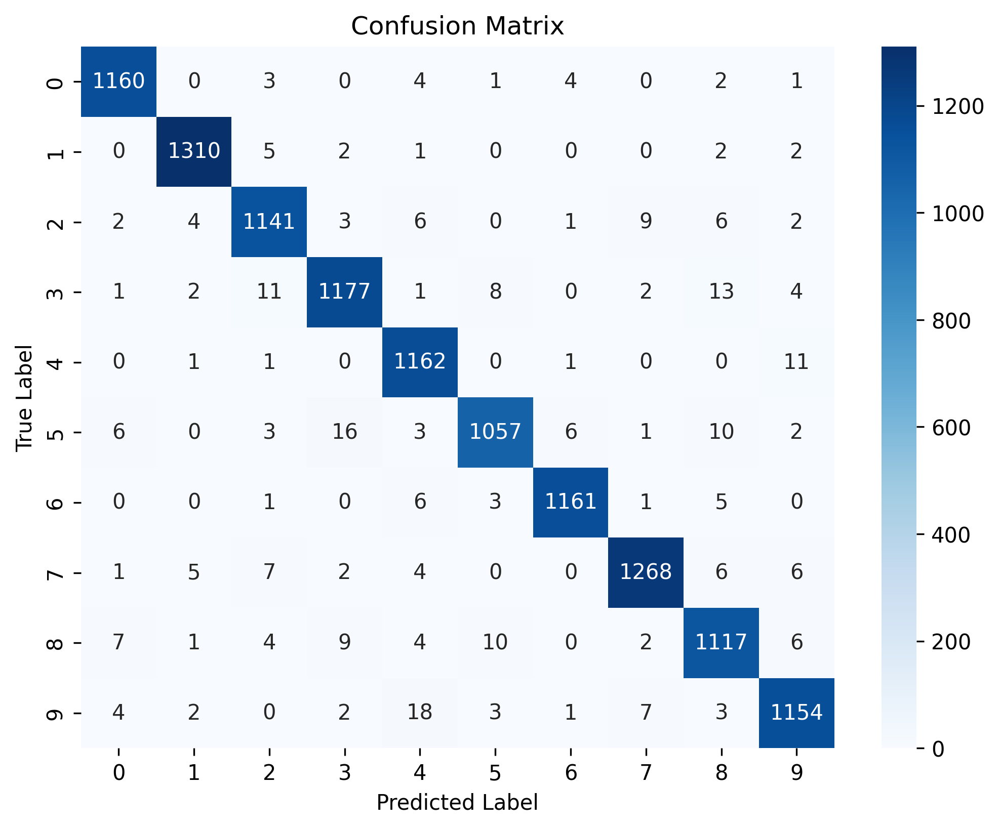
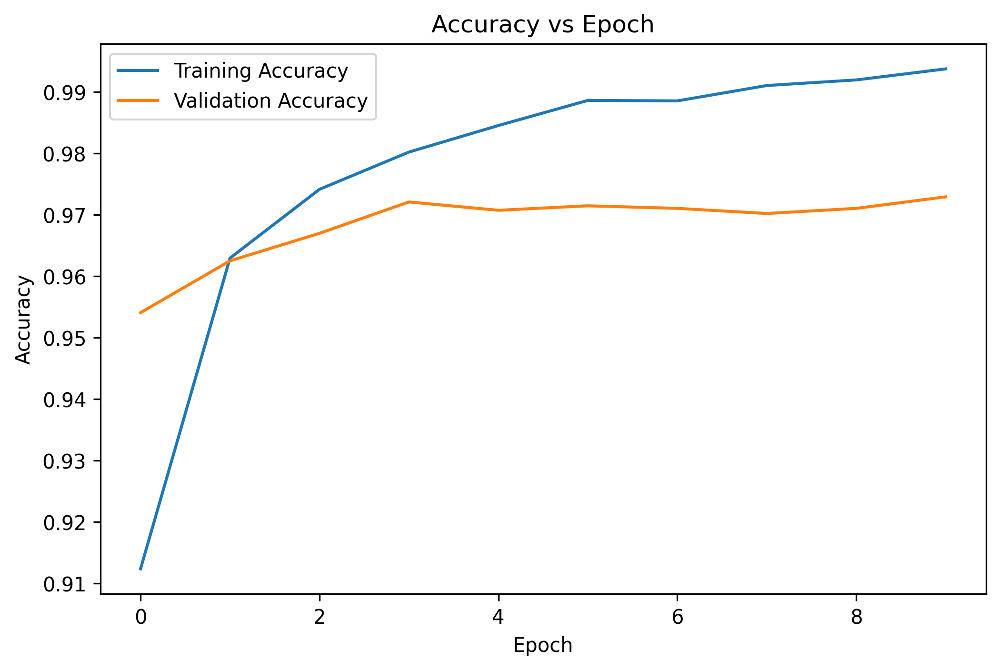
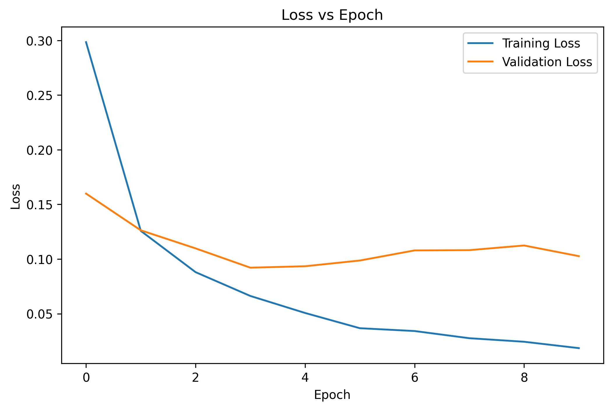

# Assignment 8

# Handwritten Digit Recognition using Artificial Neural Networks (ANN)

## Objective

The objective of this assignment is to develop an Artificial Neural Network (ANN) using TensorFlow/Keras to classify handwritten digits (0–9) from the MNIST dataset.

---

## Dataset Link

MNIST Handwritten Digits Dataset

https://www.kaggle.com/datasets/oddrationale/mnist-in-csv

---

## Libraries Used

- pandas
- numpy
- matplotlib
- seaborn
- scikit-learn
- tensorflow
- keras
- jupyter

---

## Methodology

1. Loaded the MNIST dataset.
2. Performed data preprocessing.
3. Checked for missing values.
4. Separated features and target labels.
5. Normalized pixel values to the range 0–1.
6. Split the dataset into 80% training and 20% testing.
7. Applied one-hot encoding to the target labels.
8. Built an ANN with two hidden layers.
9. Trained the model for 10 epochs.
10. Evaluated the model using accuracy, confusion matrix, and classification report.

---

## Model Architecture

- Input Layer: 784 neurons
- Hidden Layer 1: 128 neurons (ReLU)
- Hidden Layer 2: 64 neurons (ReLU)
- Output Layer: 10 neurons (Softmax)
- Optimizer: Adam
- Loss Function: Categorical Crossentropy
- Metric: Accuracy

---

## Results

- Successfully classified handwritten digits using ANN.
- Generated Confusion Matrix and Classification Report.
- Visualized Accuracy vs Epoch and Loss vs Epoch.
- Achieved high classification accuracy on the MNIST dataset.

---

## Visualizations

### Confusion Matrix



### Accuracy vs Epoch



### Loss vs Epoch



---

## Conclusion

The Artificial Neural Network successfully classified handwritten digits with high accuracy. Hidden layers enabled the network to learn complex features from image data, while the Softmax output layer performed multi-class classification effectively. Deep Learning provides automatic feature learning, making it highly suitable for image recognition tasks. However, ANN models require significant computational resources and sufficient training data for optimal performance.

---

## Repository Structure

```text
Assignment-08/
│
├── notebook/
│   └── Assignment-8.ipynb
│
├── images/
│   ├── confusion_matrix.png
│   ├── accuracy_vs_epoch.png
│   └── loss_vs_epoch.png
│
├── README.md
└── requirements.txt
```