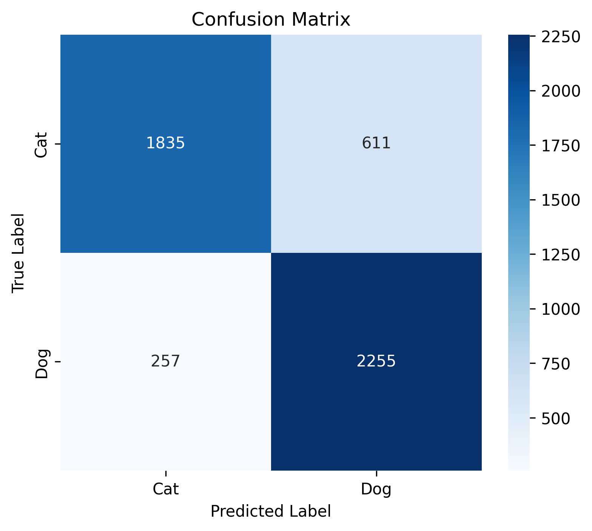
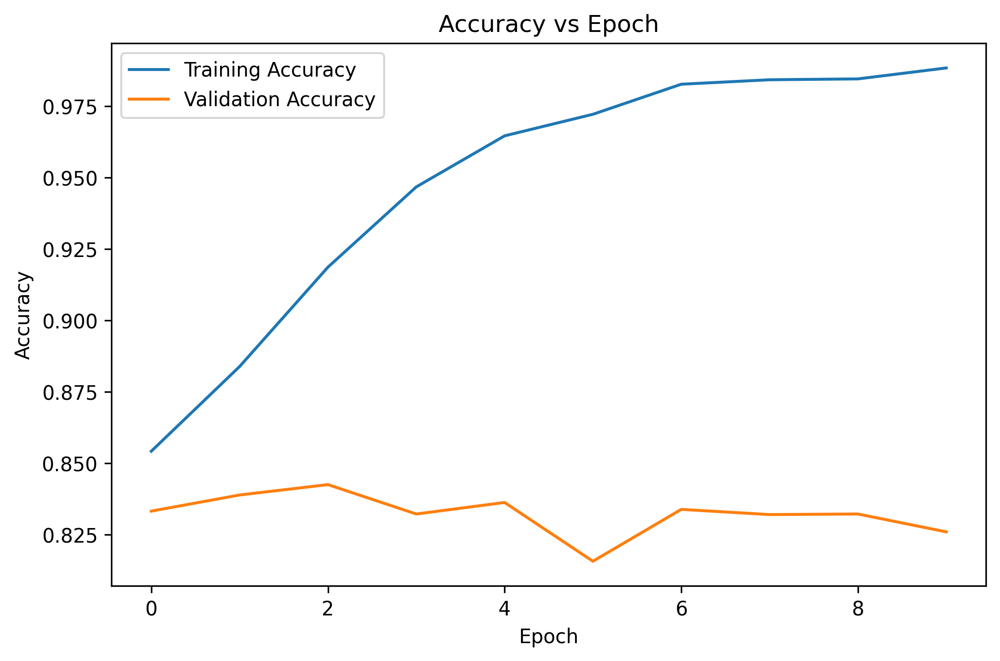
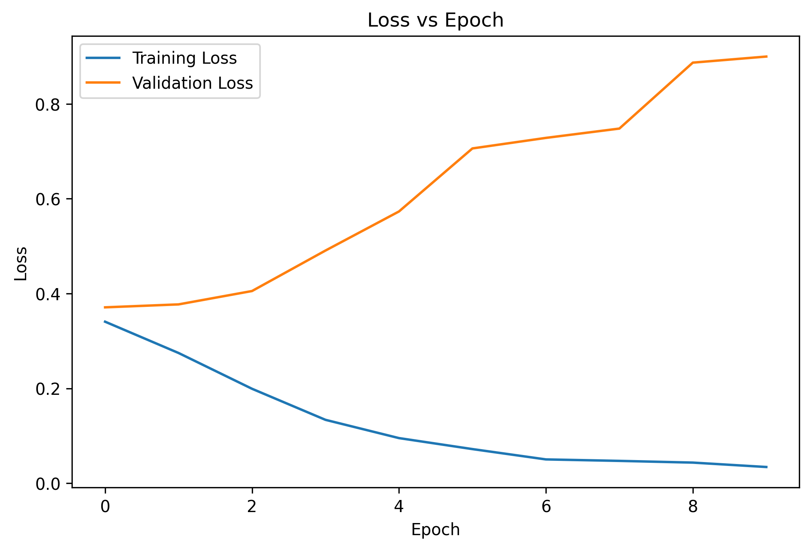

# Assignment 9

# Image Classification using Convolutional Neural Networks (CNN)

## Objective

The objective of this assignment is to develop a Convolutional Neural Network (CNN) using TensorFlow/Keras to classify images into two categories: **Cats and Dogs**.

---

## Dataset

**Cats vs Dogs Dataset**

Dataset Source: Kaggle

https://www.kaggle.com/datasets/shaunthesheep/microsoft-catsvsdogs-dataset

> The dataset is not included in this repository. It can be downloaded using the link above.

---

## Libraries Used

- NumPy
- Matplotlib
- Seaborn
- TensorFlow
- Keras
- Scikit-learn
- Pillow

---

## Methodology

1. Loaded and explored the Cats vs Dogs image dataset.
2. Identified the dataset classes, image dimensions, and total number of images.
3. Removed corrupted or unsupported image files.
4. Resized images to **128 × 128 pixels**.
5. Normalized pixel values to the range **0–1**.
6. Split the dataset into **80% training** and **20% testing**.
7. Created image datasets using TensorFlow/Keras.
8. Developed a Convolutional Neural Network (CNN).
9. Trained the model for **10 epochs**.
10. Evaluated the model using classification metrics and visualizations.

---

## CNN Architecture

The CNN consists of:

- Conv2D – 32 filters, 3×3 kernel, ReLU
- MaxPooling2D – 2×2
- Conv2D – 64 filters, 3×3 kernel, ReLU
- MaxPooling2D – 2×2
- Conv2D – 128 filters, 3×3 kernel, ReLU
- MaxPooling2D – 2×2
- Flatten Layer
- Dense Layer – 128 neurons, ReLU
- Output Layer – 1 neuron, Sigmoid

### Model Configuration

- **Optimizer:** Adam
- **Loss Function:** Binary Crossentropy
- **Evaluation Metric:** Accuracy
- **Epochs:** 10

---

## Model Performance

| Metric | Score |
|---|---:|
| Accuracy | 82.61% |
| Precision | 78.68% |
| Recall | 89.77% |
| F1-Score | 83.86% |

The CNN demonstrated good overall performance in distinguishing between Cat and Dog images.

---

## Visualizations

### Confusion Matrix



### Accuracy vs Epoch



### Loss vs Epoch



---

## Key Observations

- The CNN achieved a test accuracy of **82.61%**.
- The model achieved a recall of **89.77%**, indicating strong identification of the positive class.
- The classification report produced F1-scores of **0.81 for Cats** and **0.84 for Dogs**.
- The CNN demonstrated effective feature extraction and binary image classification using convolution and pooling layers.

---

## Conclusion

The Convolutional Neural Network successfully classified Cat and Dog images with an accuracy of **82.61%**. Convolutional layers enabled the model to extract important visual features, while pooling layers reduced spatial dimensions and computational complexity. Compared with traditional Artificial Neural Networks, CNNs are better suited for image data because they can automatically learn spatial features while preserving local relationships between pixels. However, CNN models can require significant computational resources and training time when working with large image datasets.

---

## Repository Structure

```text
Assignment-09/
│
├── data/
│   └── PetImages/          # Dataset stored locally and excluded from Git
│
├── images/
│   ├── confusion_matrix.png
│   ├── accuracy_vs_epoch.png
│   └── loss_vs_epoch.png
│
├── notebook/
│   └── Assignment-9.ipynb
│
├── README.md
└── requirements.txt
```